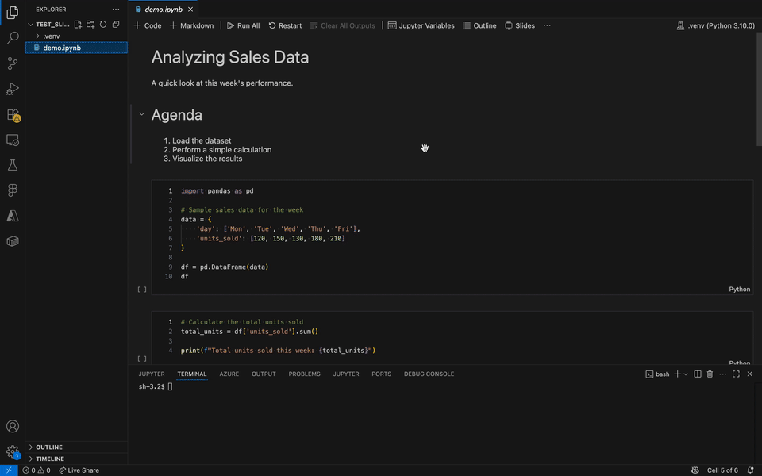

# IPYNB Slide Preview

> The missing interactive slide show for Jupyter in VS Code. Your notebook **is** the presentation—edit, run code, and present in a single, fluid experience.
---

IPYNB Slide Preview transforms your Jupyter Notebooks into an interactive presentation, right inside of VS Code. Move seamlessly from analysis to presentation without ever leaving your editor.

<!-- 
 -->
<!--  -->

## Features

* **Interactive Slide Show**: View each cell of your `.ipynb` file as a separate, clean slide.
* **Full Code Execution**: Run code cells directly from the slide view and see outputs rendered immediately, powered by a full Jupyter kernel backend.
* **Distraction-Free Presentation Mode**: A fully immersive mode that hides all VS Code UI "chrome" for a clean presentation experience.
* **Complete Toolbars**:
    * **Main Toolbar**: Global actions like "Run All", "Restart KPernel", "Clear All Outputs", "Undo", and "Redo".
    * **Cell Toolbar**: Per-slide controls to run or delete the current cell.
* **Seamless Editing**:
    * Full-featured code editing with syntax highlighting in code cells.
    * **Double-click** on a markdown slide to instantly switch to an editor.
* **Theme Aware**: Automatically adapts to your VS Code theme (Light, Dark, and High Contrast).
* **Keyboard Shortcuts**: Navigate and execute cells with familiar keyboard shortcuts.
* **Execution Count**: Tracks and displays the execution order (`[1]`, `[2]`, etc.) of your code cells, just like a standard notebook.

## Usage

There are multiple ways to open your notebook in the slide preview.

### Opening the Slide Preview

1.  **From the Notebook Toolbar**: When you have a standard `.ipynb` notebook open, click the **Presentation icon** in the top-right toolbar.
2.  **From the Command Palette**: Open the Command Palette (`Ctrl+Shift+P` or `Cmd+Shift+P`) and search for **"Open with IPYNB Slide Editor"**.
3.  **From the Explorer**: Right-click on any `.ipynb` file in the file explorer and select **"Open with IPYNB Slide Editor"**.

### Interacting with Slides

* **Editing Code**: Simply click inside a code cell to start editing.
* **Editing Markdown**: **Double-click** anywhere on a markdown slide to open the text editor.
* **Adding Slides**: Hover on the left or right side of a slide to reveal controls for adding new code or markdown cells.

### Keyboard Shortcuts

| Action | Shortcut (Windows/Linux) | Shortcut (macOS) |
| :--- | :--- | :--- |
| Run Cell | `Ctrl+Enter` | `Cmd+Enter` |
| Next Slide | `→` | `→` |
| Previous Slide | `←` | `←` |
| Exit Presentation Mode | `Esc` | `⎋` |

## Requirements

You must have the [Microsoft Python Extension](https://marketplace.visualstudio.com/items?itemName=ms-python.python) installed, as this extension relies on it to find and manage Python environments for the Jupyter kernel.

<!-- ## Extension Settings

Include if your extension adds any VS Code settings through the `contributes.configuration` extension point.

For example:

This extension contributes the following settings:

* `myExtension.enable`: Enable/disable this extension.
* `myExtension.thing`: Set to `blah` to do something. -->

## Known Issues

* The manual presentation mode uses a `toggle` command to hide the Side Bar. If the Side Bar is already closed when you enter presentation mode, it will be opened instead. For best results, enter presentation mode from the standard editor view.

## Release Notes

All notable changes to this project are documented in the [CHANGELOG.md](CHANGELOG.md) file.

<!-- 
## Following extension guidelines

Ensure that you've read through the extensions guidelines and follow the best practices for creating your extension.

* [Extension Guidelines](https://code.visualstudio.com/api/references/extension-guidelines) -->
